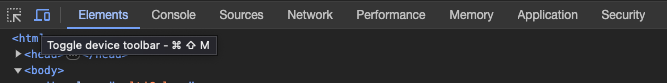
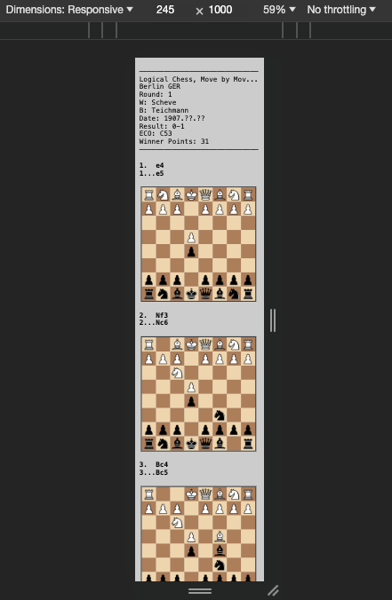
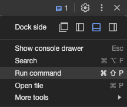
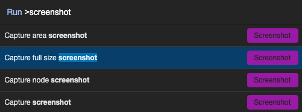

# Chess Guess

This program is custom-designed to generate pre-computed "guess the move" (gtm) chess materials that players can reference when studying from books and other resources. For example purposes, this code base includes the first 10 games (PGN format) from the book "Logical Chess Move By Move" by Chernev. Upon analysis completion, generated gtm results are placed in the `./output` folder.

## How It Works

Locate -> Analyze -> Browser View -> Image Generation

### Locate

Download your favorite chess matches (PGN format) from sites like chessgames.com.

### Analyze

#### Commands

`./analyze filename` (single PGN game, don't add the .pgn extension)

`./analyze all` (all PGN games, located in ./pgn)

#### Output

When analysis completes, a proprietary .gtm result file will have been created for each .pgn file.

### Browser View

With the `gtmViewer.html` file open in VSCode, click the `Go Live` button in the bottom right to load the Viewer. Click on the "Choose Files" button and load (one or more) your .gtm files. The browser (tested on Chrome, Brave, and lightly on Safari) will render the results for preview and preparation for the final step.

### Image Generation

1. Right-click on the Viewer with your contents already rendered, load your developer tools, and toggle on the `device toolbar` button (2nd from left).
   
2. Set the dropdown to `responsive`, with dimensions of 245 \* 1000. You should see something like the following:
   
3. Click the vertical `...` menu in the developer tool area and select `Run Command` and search for `screenshot` and choose `Capture Full Size Screenshot`:
   
   

The saved .png file is designed to be perfectly suited to zoom in to the width of a phone so that you can gradually vertically scroll through results as you guess the move.

## Installation & Setup

### VSCode Virtual Environment

1. Press `Cmd + Shift + P`
2. Select `Python: Create Environment`
3. Select `Venv`
4. Select latest Python version.

If not prompted to automatically install requirements for the project:

5. Add new terminal below (`+`) and ensure the new console has a prefix of `(.venv)`.
6. Run `pip install -r requirements.txt` to install all required packages. This txt file was originally created via `pip freeze > requirements.txt`.

### VSCode Extensions

Install the following extensions:

-   `Live Server` (by Ritwick Dey)

## FAQ

### What advantages does this project offer over simply using a chess engine real-time during chess study?

-   A scoring ruleset has been designed and automated to provide a simple framework to evaluate both your own play and that of the master / grandmaster you are pseudo-competing with.
-   Engine analysis time can be spent up front to not distract from study sessions.
-   The top 5 moves have been analyzed for every position beyond move 5 (treated as the "opening" cutoff) so that players have the ability to evaluate how their move choice faired, rather than simply "getting it wrong" by not matching the move of the game winner.

### Is Stockfish included with this project?

The Stockfish 13 mac binary has been bundled with this project. If you'd prefer to build your own binary or use a newer binary, simply update the following line in the `chessguess.py` script with where your binary is located:

`engine = chess.engine.SimpleEngine.popen_uci("./bin/stockfish-13")`
