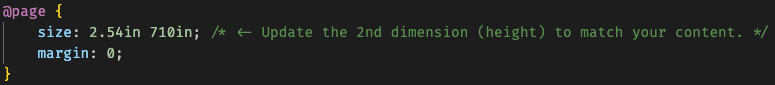

# Chess Guess

This program is custom-designed to generate pre-computed "guess the move" (gtm) chess study materials in PDF format that players can reference when studying from books and other resources. For example purposes, this code base includes the first 10 PGN games (all freely available) based on the book "Logical Chess Move By Move" by Chernev. Upon analysis completion, generated gtm results are placed in the `./output` folder.

## How It Works

Locate -> Analyze -> Scoring -> Browser View -> PDF Generation

### Locate

Download your favorite chess matches (PGN format) from sites like chessgames.com.

### Analyze

#### Commands

`./analyze filename` (single PGN game, don't add the .pgn extension)

`./analyze all` (all PGN games, located in ./pgn)

#### Output

When analysis completes, a proprietary .gtm result file will have been created for each .pgn file.

### Scoring

For every board position that the recorded game winner faces, each is evaluated by Stockfish (using a depth of 24 ply to strike a balance between accuracy and performance). The resulting strongest move is then considered the benchmark by which each of the top 5 moves are evaluated and scored.

-   `Score difference` <= 25 centipawns = 3 points
-   25 < `Score difference` <= 75 centipawns = 2 points
-   75 < `Score difference` <= 125 centipawns = 1 points
-   `Score difference` > 125 centipawns = 0 points

The moves chosen by the recorded game winner are automatically scored and tallied as the last part of each game entry. As a player plays guess the move, they can record their own scores and compare their total at the end to that of the game winner to measure approximate game performance.

### Browser View

With the `gtmViewer.html` file open in VSCode, click the `Go Live` button in the bottom right to load the Viewer. Click on the "Choose Files" button and load (one or more) your .gtm files. The browser (tested on Chrome, Brave, and lightly on Safari) will render the results for preview and preparation for the final step.

### PDF Generation

1. Load the gtm analysis results using the `gtmViewer.html` and simply browser print to PDF the webpage.
2. Due to the CSS configurations, you should see a very tall sliver (rather than a standard paper-sized PDF).
3. All of the preview results can be adjusted to fit on a single 1-page PDF to eliminate page breaks. In order to make height adjustments, simply update the following as required within the `gtmViewer.css` file:
   
4. End result will look like `exampleGames.pdf` in the `./output` folder.
5. Bonus: If you'd like to activate chessboard hotlinks within the PDF so that you can click / tap on them to take you directly to an analysis board (see `exampleGamesHotlinked.pdf` in the `./output` folder), you can flip this setting by updating `enableAnalysisLinking = false;` to `enableAnalysisLinking = true;` within gtmViewer.js. Be aware that this setting is disabled by default as it generates PDF file sizes an order of magnitude larger (due to the way browsers generate PDFs based on DOM content).

## Installation & Setup

### VSCode Virtual Environment

1. Press `Cmd + Shift + P`
2. Select `Python: Create Environment`
3. Select `Venv`
4. Select latest Python version.

If not prompted to automatically install requirements for the project:

5. Add new terminal below (`+`) and ensure the new console has a prefix of `(.venv)`.
6. Run `pip install -r requirements.txt` to install all required packages. This txt file was originally created via `pip freeze > requirements.txt`.

### VSCode Extensions

Install the following extensions:

-   `Live Server` (by Ritwick Dey)

## FAQ

### What advantages does this project offer over simply using a chess engine real-time during chess study?

-   A scoring ruleset has been designed and automated to provide a simple framework to evaluate both your own play and that of the master / grandmaster you are pseudo-competing with.
-   Engine analysis time can be spent up front to not distract from study sessions.
-   The top 5 moves have been analyzed for every position beyond move 5 (treated as the "opening" cutoff) so that players have the ability to evaluate how their move choice faired, rather than simply "getting it wrong" by not matching the move of the game winner.

### Is Stockfish included with this project?

The Stockfish 13 mac binary has been bundled with this project. If you'd prefer to build your own binary or use a newer binary, simply update the following line in the `chessguess.py` script with where your binary is located:

`engine = chess.engine.SimpleEngine.popen_uci("./bin/stockfish-13")`
